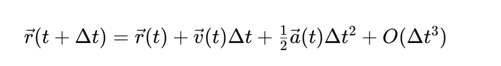
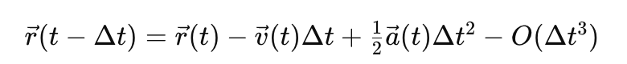
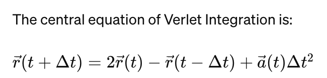
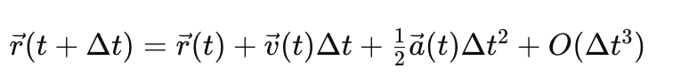
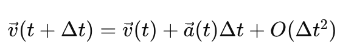
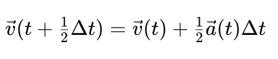
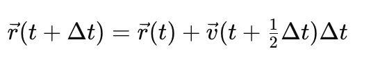
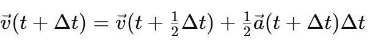

# **The Verlet Algorithm** 
## **Theoretical Background:** 
-	The [Verlet Integration](https://www.algorithm-archive.org/contents/verlet_integration/verlet_integration.html), also known as the Verlet algorithm, is a numerical method used to solve Newton's equations of motion for systems of particles. 
-	It is  popular in molecular dynamics simulations for its simplicity and excellent energy conservation properties. 
### **Derivation**
-	The core idea behind the Verlet Integration is to compute the positions of particles at a future time step using only their current positions, the positions at a previous time step, and the net forces currently acting on them (which are used to compute acceleration). 
-	This approach stems from the second-order Taylor expansions of the position of a particle.
-	Consider a particle with position **r(t)** at time **t** and let **Δt** be a small-time increment. 
-	The position of the particle at time **t+Δt** can be expanded as:

-	Similarly, the position of the particle at time **t − Δt** can be expanded as:

-	where **v(t)** is the velocity of the particle at time **t**, and
-	 **a(t)** is its acceleration due to forces acting upon it. 
-	The term **O(Δt^3)** represents the error term in the Taylor series expansion, which becomes negligible as **Δt** becomes small.

-	By adding these two equations, the terms involving **v(t)** cancel out, and the error term is of a higher order, which is typically ignored for small **Δt**, leading to:

where: 
-	**r(t + Δt)** is the position at future time **t + Δt**
-	**r(t)** is the current position at time **t**, 
-   **r(t − Δt)** is the position at the past time **t − Δt**, 
-	**a(t)** is the acceleration at time **t**, and 
-	**Δt** is the time step.

Essentially, this equation estimates the new position **(r( t+ Δt))** based on the current and previous positions **(r(t) and r(t − Δt))**, as well as the current acceleration **(a(t))**, with **Δt** being the time step.  

## **Practical Implementation:** 
**Initialisation:** 
-	At the start, since there's no "previous position" **(r(t − Δt))** available, an initial approximation is necessary. 
-	This is derived using a first-order approximation like **(t − Δt) = r(t)− v(t) Δt+ 1/2 a(t)Δt^2**
**Loop Over Time Steps:** 
-	For each time step in the simulation, calculate the new positions using the central equation of Verlet Integration. 
-	Update the positions of all particles accordingly. 
Force Calculation: 
-	After updating the positions, calculate the new forces (and thus accelerations) acting on each particle due to their new positions.

# **Velocity Verlet Algorithm:**
-	The Velocity Verlet algorithm is an extension of the Verlet algorithm, designed to explicitly calculate both positions and velocities of particles at each time step, offering a good balance between computational efficiency, accuracy, and ease of implementation. 

## Theoretical Background:
-	The Velocity Verlet algorithm can be derived from the Taylor series expansion of particle positions and velocities. 
-	Consider a particle with position **r(t)** and velocity **v(t)** at time **t**, subject to an acceleration **a(t)** due to forces acting on it according to Newton's second law. 
-	The position of the particle at a future time **t + Δt** can be expanded using the Taylor series as:

-	Similarly, the velocity v(t + Δt) can be expanded as:

-	The Velocity Verlet algorithm refines this by incorporating the acceleration at **t + Δt** into the velocity update, splitting the velocity update into two half-steps:
1.	First, it partially updates the velocity using the acceleration at the start of the time step:

2.	Then, it updates the position using this partially updated velocity:

3.	After updating the position, the new acceleration **a(t+ Δt)** is calculated based on the forces at the new position.

4.	Finally, it completes the velocity update with

# **Implementation for Verlet Integration (verlet_integration.py)**
This Python script implements the Verlet Integration algorithm. 

### Key Features
-	Implements Verlet Integration for systems of particles in a multi-dimensional space.
-	Incorporates a simple gravitational force acting towards the negative y-axis as an example of an external force.
-	Includes an example usage block that simulates the motion of two particles under gravity, prints their final positions, and plots their trajectories.

### Prerequisites
-	Python 3.x
-	NumPy
-	Matplotlib (for plotting trajectories)

### How to run
-	Ensure Python 3.x, NumPy, and Matplotlib are installed in your environment.
-	Save the script as verlet_integration.py
-	Run the script using Python: python verlet_integration.py
-	The script will output the final positions of the particles and display a plot of their trajectories over time.

### Example Output 
-	After simulating their motion under gravity for a specified number of steps, the console will print the final positions of two particles.
-	A plot showing the trajectories of these particles will be displayed.

# **Implementation for Velocity Verlet Integration (velocity_verlet.py)**
This Python script demonstrates the Velocity Verlet Integration algorithm. 

### Key Features
-	Utilises the Velocity Verlet Integration method for multi-dimensional particle systems.
-	Imports and uses a simple gravitational acceleration function from verlet_integration.py to simulate forces acting on particles.
-	Features an example block that simulates two particles under gravity, prints their final positions, and visualises their trajectories.

### Prerequisites
-	Python 3.x
-	NumPy
-	Matplotlib (for plotting trajectories)
-	verlet_integration.py (for the acceleration function)

### How to Run
-	Make sure Python 3.x, NumPy, and Matplotlib are installed and that verlet_integration.py is in the same directory or the Python path.
-	Save this script as velocity_verlet.py.
-	Execute the script: python velocity_verlet.py
-	The script outputs the final positions of the simulated particles and a plot of their trajectories during the simulation.

### Example Output
-	The script prints the final positions of two simulated particles to the console.
-	A graphical plot showing the paths these particles take illustrates gravity's effect on their motion.

